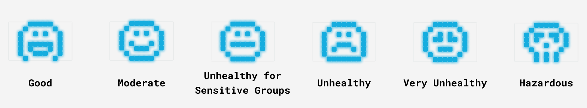
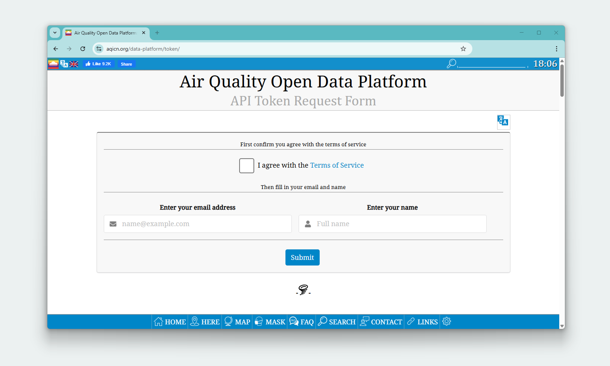
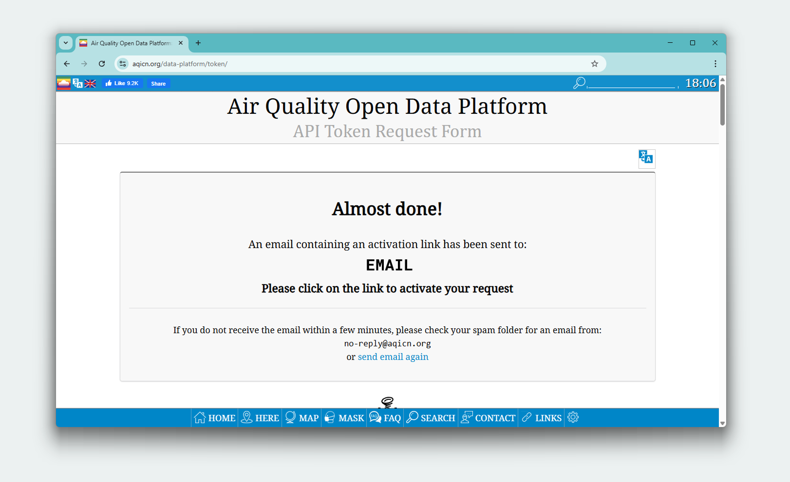
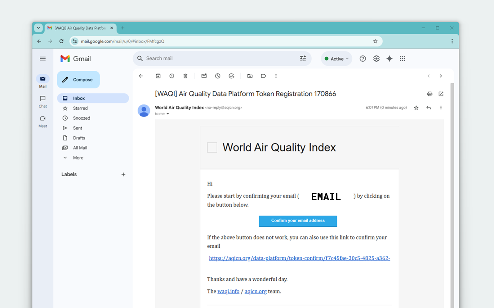
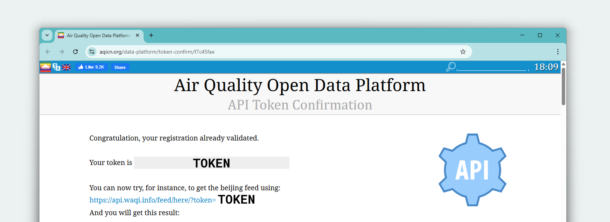
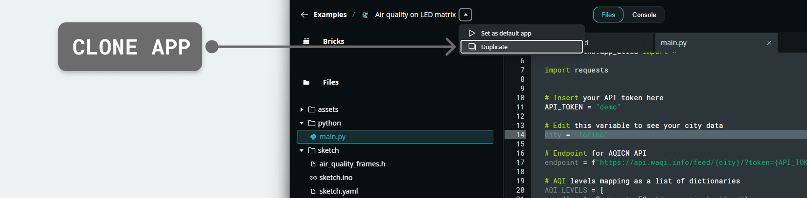

# Air Quality Monitoring App

The **Air Quality Monitoring App** displays real-time air quality data from the *AQICN* service on the Arduino UNO Q LED matrix. It displays air quality levels ranging from "Good" to "Hazardous" using animated face patterns that reflect the current air quality, from smiling to distressed.


## Description

The App fetches air quality data from the *AQICN API* for a specified city. It converts numeric AQI values into visual patterns on the 8 x 13 LED matrix. When the air quality changes, the display updates with corresponding emoji icons representing different pollution levels.



The Python® script handles API communication and data processing, while the Arduino sketch manages LED matrix display and polling. The Router Bridge enables communication between the Python environment and the microcontroller.

## Bricks Used

**This example does not use any Bricks.** It shows direct Router Bridge communication between Python® and Arduino.

## Hardware and Software Requirements

### Hardware

- Arduino UNO Q (x1)
- USB-C® cable (for power and programming) (x1)

### Software

- Arduino App Lab

**Note:** You can also run this example using your Arduino UNO Q as a Single Board Computer (SBC) using a [USB-C® hub](https://store.arduino.cc/products/usb-c-to-hdmi-multiport-adapter-with-ethernet-and-usb-hub) with a mouse, keyboard and display attached.

## How to Use the Example

### Obtain an API Token (Required for your city data)

To display air quality data for your specific city, you will need a free API token from AQICN:

1. Visit the AQICN token request page following this link: [https://aqicn.org/data-platform/token/](https://aqicn.org/data-platform/token/)



2. Fill in your details and complete the registration form with:

- Your email address
- Name or organization
- Terms of service agreement



3. Check your email. AQICN will send a confirmation email to the address you provided. Click the confirmation link in the email.



4. After email confirmation, you'll be redirected to a page displaying your unique API token. It will look something like: 
   
 ```bash
a1b2c3d4e5f6g7h8i9j0k1l2m3n4o5p6q7r8s9t0
 ```



### Configure the Application

1. Clone the example to your workspace



2. Update the API token in your code. Open the `main.py` file and locate this line:
   
 ```python
# Insert your API token here
API_TOKEN = "demo"
 ```
   
Replace `"demo"` with your actual API token:
   
 ```python
# Insert your API token here
API_TOKEN = "a1b2c3d4e5f6g7h8i9j0k1l2m3n4o5p6q7r8s9t0"
 ```

3. Set your city. If you want to monitor a different city, update the `city` variable in `main.py`:
   
 ```python
city = "Your City Name"
 ```

### Run the App


## How it Works

Once the application is running, the device performs the following operations:

- **Fetching air quality data from the AQICN API.**

 The application makes direct API requests to the AQICN service:

 ```python
import requests

endpoint = f"https://api.waqi.info/feed/{city}/?token={API_TOKEN}"
response = requests.get(endpoint)
response_json = response.json()
 ```
    
 The `get_air_quality()` function handles the API communication, JSON parsing, and error checking. It extracts the AQI value from the response and converts it to a readable category using the `map_aqi_level()` function.

- **Converting numeric values to readable categories.**

The `map_aqi_level()` function converts numeric pollution measurements into standard categories:

```python
def map_aqi_level(aqi_value: int) -> str:
    for level in AQI_LEVELS:
        if level["min"] <= aqi_value <= level["max"]:
             return level["description"]
    return "N/A"
```

For example, a pollution reading of 75 is labeled as *Moderate* rather than leaving users to interpret what that number means.

- **Exposing air quality functions to the microcontroller.**

The Router Bridge makes the air quality function callable from the Arduino:

```python
Bridge.provide("get_air_quality", get_air_quality)
```

- **Polling for air quality updates from the Arduino.**

The Arduino sketch calls the Python function once every second:

```arduino
Bridge.call("get_air_quality").result(airQuality)
```

Regular checking ensures the display remains current with changing environmental conditions.

- **Displaying air quality levels on the LED matrix.**

The sketch maps each air quality level to corresponding visual patterns:

```arduino
if (airQuality == "Good") {
    matrixWrite(good);
} else if (airQuality == "Moderate") {
    matrixWrite(moderate);
} // ... additional levels
```

The high-level data flow looks like this:

```
AQICN API → Python Direct Request → Router Bridge → MCU loop() → LED Matrix
```

## Understanding the Code

Here is a brief explanation of the application components:

### 🔧 Backend (`main.py`)

The Python® code serves as the system's data processor, handling all communication with the air quality service and converting raw information into a format that the LED display can use.

- **`API_TOKEN`, `city`, `endpoint`**: Simple constants that you edit to target a different location and authenticate with the service.

- **`AQI_LEVELS`**: Table defining category ranges (0-50 = Good, 51-100 = Moderate, etc.) following standard air quality guidelines.

- **`map_aqi_level()`**: Looks up the textual level for a numeric AQI by checking which range the number falls into.

- **`get_air_quality()`**: Makes a direct HTTP request to the AQICN API using the `requests` library, parses the JSON response, validates the status, extracts the AQI value, converts it to a readable level using `map_aqi_level()`, and returns the corresponding level string.

- **`requests.get(endpoint)`**: Performs the actual HTTP GET request to the AQICN API with the configured city and API token.

- **Response validation**: Checks that the API response status is 'ok' and that data is present before processing the AQI value.

- **`Bridge.provide(...)`**: Makes `get_air_quality` callable from the microcontroller, creating the communication link.

- **`App.run()`**: Starts the Router Bridge runtime that enables the Python®-Arduino communication.

### 🔧 Hardware (`sketch.ino`)

The Arduino code is focused on hardware management. It requests information and displays it.

- **`matrixBegin()`**: Initializes the matrix driver, making the LED display ready to show patterns.

- **`Bridge.begin()`**: Opens the serial communication bridge to the host Python® runtime.

- **`loop()`**: Once per second, calls the Python® function, selects the corresponding 13 × 8 frame (`good`, `moderate`, etc.), and shows it with `matrixWrite(frame)`.

- **`air_quality_frames.h`**: Header file that stores the pixel patterns for each air quality level, plus a fallback `unknown` pattern for error cases.