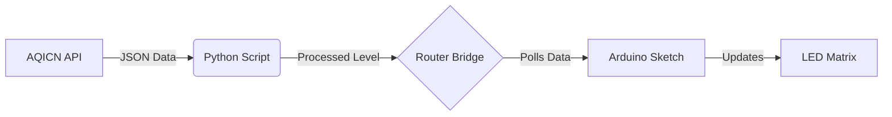

# 🌬️ Air Quality Monitoring App


The **Air Quality Monitoring App** displays real-time air quality data from the [AQICN](https://aqicn.org/) service on the Arduino UNO Q LED matrix. It visualizes air quality levels ranging from "Good" to "Hazardous" using animated face patterns that reflect the current air quality—from smiling to distressed.

---

## 📋 Overview

This application bridges the gap between web APIs and hardware. It fetches air quality data for a specific city using Python and displays the result on an Arduino UNO Q's LED matrix.

*   **Python Backend**: Handles API communication, data processing, and error handling.
*   **Arduino Sketch**: Manages the LED matrix display and polls the Python backend for updates.
*   **Router Bridge**: Enables seamless communication between the Python environment and the microcontroller.


---

## 📂 Project Structure

```text
Denver-Air-Quality-Sketch/
├── app.yaml                # Application configuration
├── assets/                 # Images and documentation assets
├── python/
│   ├── api_secrets.py      # API Token storage (Git ignored)
│   └── main.py             # Main Python script for API fetching
├── sketch/
│   ├── air_quality_frames.h # LED Matrix frame definitions
│   ├── sketch.ino          # Main Arduino sketch
│   └── sketch.yaml         # Sketch configuration
└── README.md               # Project documentation
```

---

## 🛠️ Hardware and Software Requirements

### Hardware
*   **Arduino UNO Q** (x1)
*   **USB-C® cable** (for power and programming) (x1)
*   *(Optional)* USB-C® hub for SBC mode (mouse, keyboard, display)

### Software
*   **Arduino App Lab** or compatible environment
*   **Python 3.x** (if running locally outside App Lab)

---

## 🚀 Getting Started

### 1. Obtain an API Token
To display air quality data, you need a free API token from AQICN:

1.  Visit the [AQICN Token Request Page](https://aqicn.org/data-platform/token/).
2.  Fill in your details (Name, Email).
3.  Confirm your email address via the link sent to you.
4.  Copy your unique API token (e.g., `a1b2c3d4e5f6g7h8i9j0k1l2m3n4o5p6q7r8s9t0`).

### 2. Configure the Application

**⚠️ Important: Secure your API Token**

To keep your API token secure and out of source control, we use a separate secrets file.

1.  Navigate to the `python/` directory.
2.  Create a new file named `api_secrets.py`.
3.  Add the following code to `api_secrets.py`, replacing the placeholder with your actual token:

    ```python
    # python/api_secrets.py
    
    # Insert your API token here
    API_TOKEN = "YOUR_ACTUAL_API_TOKEN_HERE"
    ```

4.  **Note:** The `.gitignore` file is already configured to ignore `python/api_secrets.py`, so your token won't be accidentally committed to Git.

### 3. Set Your City
Open `python/main.py` and update the `city` variable to your desired location:

```python
# Edit this variable to see your city data 
city = "Denver" 
```

### 4. Run the App
1.  Connect your Arduino UNO Q.
2.  Run the project in **Arduino App Lab**.
3.  The LED matrix should light up and display the current air quality face!

---

## 🧠 How it Works

### Data Flow


### Python Backend (`python/main.py`)
*   **`get_air_quality()`**: Fetches data from AQICN, parses the JSON, and determines the AQI level.
*   **`map_aqi_level()`**: Maps the numeric AQI value to a descriptive string (e.g., "Good", "Moderate").
*   **`Bridge.provide()`**: Exposes the `get_air_quality` function so the Arduino can call it.

### Arduino Sketch (`sketch/sketch.ino`)
*   **`loop()`**: Runs every second. It calls `Bridge.call("get_air_quality")` to get the latest status.
*   **`matrixWrite()`**: Updates the LED matrix with the frame corresponding to the received air quality level.
*   **`air_quality_frames.h`**: Contains the binary definitions for the pixel art faces.

---

## 📊 AQI Levels & Icons

| AQI Range | Level | Description |
| :--- | :--- | :--- |
| **0 - 50** | 🟢 Good | Air quality is satisfactory. |
| **51 - 100** | 🟡 Moderate | Air quality is acceptable. |
| **101 - 150** | 🟠 Unhealthy for Sensitive Groups | Members of sensitive groups may experience health effects. |
| **151 - 200** | 🔴 Unhealthy | Everyone may begin to experience health effects. |
| **201 - 300** | 🟣 Very Unhealthy | Health warnings of emergency conditions. |
| **300+** | 🟤 Hazardous | Health alert: everyone may experience more serious health effects. |

---

## 📄 License
This project is licensed under the **MPL-2.0** License.
